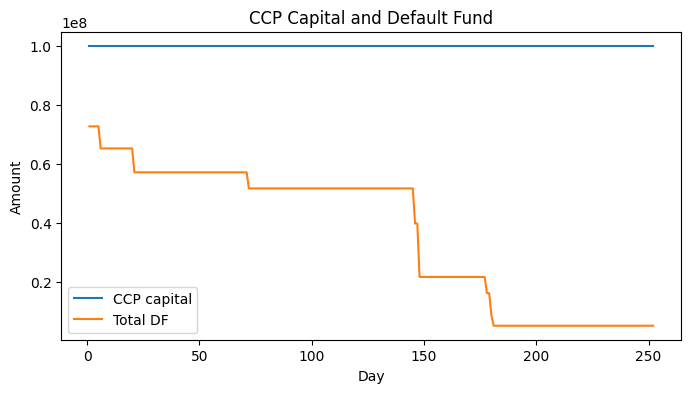

# Central Counterparty (CCP) Default Simulation

A Python-based simulation of a central counterparty (CCP) to analyze member defaults and loss allocation under stress.  
Implements a simplified CCP default waterfall and parametric margining framework for teaching and exploratory research.

---

## Features
- Market dynamics via **Geometric Brownian Motion (GBM)**
- Daily mark-to-market and **variation margin (VM)**
- **Initial Margin (IM)** computed using Gaussian Value-at-Risk (VaR)
- Default waterfall: member IM → CCP capital → mutualized DF → capped assessments → residual shortfall
- Configurable parameters for stress testing
- Clean visual output of defaults, capital depletion, and fund utilization

---

## Usage
Open `ccp_waterfall_simulation.ipynb` in [Google Colab](https://colab.research.google.com/), run the cells top-to-bottom, and adjust configuration parameters to explore different scenarios.

Requirements (also listed in `requirements.txt`):
numpy
pandas
matplotlib
scipy
---

## Example Output

---

## Context
**Tilburg University** — Research Assistant to Prof. Dr. Ron Berndsen  
*(Sep 2023 – Dec 2023, Tilburg, Netherlands)*  
Co-developed a Python-based CCP simulation for classroom teaching and academic exploration.

---

## License
This project is licensed under the MIT License.
